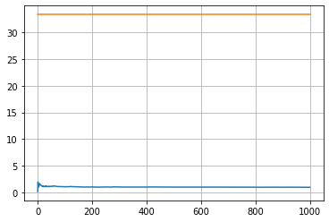
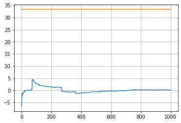

```python
# Definición de funciones 

```


```python
from funciones import *

def grandesNumeros(distribucion):
  n = len(distribucion)
  vector = []
  for k in range (1,n+1):
    mk = 0
    for i in range (1,k+1):
      mk = mk+distribucion[i-1]
    vector.append(mk/(k))
  
  return vector

def grandesNumerosFuerte(func, n, name ):
  a = []
  lf = 0.0 
  for i in range(n):
    distribucion = func(n)
    lf = sum(distribucion)/n
    a.append(lf)
  #print("\nGrandes Numeros ley fuerte", lf)
  histograma(a, name)

def limiteCentral(func, n, prom, name):
  vector_skg=[]

  for k in range(250):
    # Calcula la distribucion aleatoria
    distribucion = func(n)
    var = 0.0
    sk = sum(distribucion)
    prom = sk /n
    
    for i in distribucion:
      var=var+(i-prom)**2
    skg = (sk - prom ) / (n*var)**.5
    vector_skg.append(skg)
  histograma(vector_skg, name)
  return vector_skg

 
```

# Ejercicio 7

## Distribucion Geometrica


```python
dis = distribucionGeometrica(1000)
epsilon = [20/(.03)]*1000
mk = grandesNumeros(dis)
plot(mk, epsilon, "Problema7-Geometrica.png")
print("Problema7-Geometrica")


```

    Problema7-Geometrica


    

    


## Distribucion exponencial


```python

dis = distribucionExponencial(1000)
epsilon = [1/.03]*1000
mk = grandesNumeros(dis)
plot(mk, epsilon, "Problema7-Exponencial.png")
print("Problema7-Exponencial")
```

    Problema7-Exponencial


    

    


## Distribucion Cauchy


```python
dis = distribucionCauchy(1000)
mk = grandesNumeros(dis)
plot(mk, epsilon, "Problema7-Cauchy.png")
print("Problema7-Cauchy")
```

    Problema7-Cauchy


    

    


### Notamos que en cada una de las variables aleatorias se verifica la ley débil de los grandes números a excepcion de la cauchy pues tanto la geometrica como la exponencial tienen esperanza finita, y el promedio de la muestra es suficientemente grande para acercarse a la media poblacional. Para el caso de la cauchy no se cumplen las hipotesis, pues no su media no esta definida y por lo tanto no se cuple el teorema .


# Ejercicio 8


## Distribucion Geometrica


```python
grandesNumerosFuerte(distribucionGeometrica, 1000, "Problema8-Gn-Geometrica.png")
print("Problema8-Gn-Geometrica")
```

    Problema8-Gn-Geometrica


    

    


## Distribucion exponencial


```python
grandesNumerosFuerte(distribucionExponencial, 1000, "Problema8-Gn-Exponencial.png")
print("Problema8-Gn-Exponencial")
```

    Problema8-Gn-Exponencial


    

    


## Distribucion Cauchy


```python


grandesNumerosFuerte(distribucionCauchy,1000,"Problema8-Gn-Cauchy.png")

```


    

    


### Para verificar la ley fuerte de los grandes numros nuevamente necesitamos que la esperanza sea finita, por lo que solo podremos obtener la probabilidad de que para casi todos los puntos del soporte de la variable, los puntos de la aproximacion estan cercanos a ella. Para la cauchy la media no esta definida por lo tanto no tendria sentido hablar de una aproximacion.


## Distribucion Geometrica 


```python
n = 1000

limiteCentral(distribucionGeometrica, n , n*4, "Problema9-Geometrica.png")
print("Problema9-Geometrica")
```

    Problema9-Geometrica


    

    


## Diistribucion Exponencial


```python

limiteCentral(distribucionExponencial,n,n, "Problema9-exponencial.png")
print("Problema9-Exponencial")
```

    Problema9-Exponencial


    

    


### Limite limiteCentral, notamos que cuando a nuestra variable se le resta su media poblacional y se divide entre su desviacion estandar esta tiene en distribucion a una variable aleatoria normal(0,1) si su esperanza es finita, esto se cumplio solo para las variables que distribuyen exponencial y geometricamente pues para la funcion de cauchy la esperanza no existe y a su vez no existe su varianza. Para la variable cauchy al sacar los mk, notamos que la funcion no converge a ningun punto, mientras que para la funicon geometrica y exponencial si.
